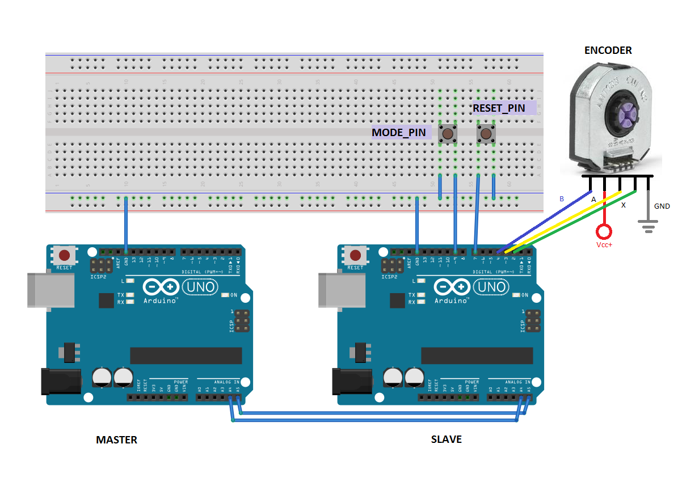

ENCODER BOARD
========================


##PURPOSE


The purpose of the program is to connect two Arduino boards thanks to I2C connection; with the master as the reciver and the slave, as sender and measurer of encoders angles and rounds.

###REQUIREMENT:

* two or more arduino boards;
* jumpers and cables;
* breadboard;
* one or more encoders;
* two buttons or just two jumpers to simulate the buttons.

###SETTING UP ARDUINO BOARDS:

* connect the Slave's SCL pin with the Master's SCL pin and the Slave's SDA pin with the Master's SDA pin;
* attach the button on the breadboard;
* connect the encoder/s to the Slave board;

##SLAVE BOARD


**CONFIGURATION:**

In order to set: the values, slave's address and pins; the program helps the user doing the setting process on the serial monitor.

Firstly, to access to this mode, the **mode_pin has to be low**.

``` c++
if (digitalRead(MODE_PIN) == LOW) {
Serial.begin(SERIAL_BAUD);
state = Config;
EncS.settings_info(); 
} 
```

Secondly, you have to **write down the settigns** on the serial port:

with those commands you have to **write first the number and then the command letter**.

* 'n' in order to set the *number of encoders*;
* 'a' to set the slave's *address*;
* 'r' to set the *resolution* of every encoders;
* 'A' ... 'D' in order to set encoder's *a pins*;
* 'E' ... 'H' in order to set encoder's *b pins*;
* 'I' ... 'N' in order to set encoder's *x pins*.

Instead, the commands below **don't need numbers before the letter**.

* 'Z' or 'z' to consider or not the index signal;
* 's' to *save* the settings;
* 'h' to see the values.

**To end** the configuration process you have to **turn high** the **MODE_PIN** and **reset the board**; thanks to the libray **EEPROM** the settings will be rememberd, as long as they have been saved.

**DEFAULT SETTINGS**

**To reset the settings** with the default values you must **set low the RESET_PIN** , saving in to the EEPROM the values firstly setted up by the constructor method. In this way the settings setted up by the user are overlooked and overwritten by the default settings.


**INTERRUPT AND INDEX**

In order to have an higher precision you can switch on the **index** (`read_index = true`), and connect x channels to the Slave. If the engine has to do lots of rounds, this is the best option with the lower possibility of making mistakes.

The code can afford up to 4 pins connected with the x channels and all of them need to be interrupt pins.

```c++
func_ptr ISRs[] = {index_ISR_0, index_ISR_1, index_ISR_2, index_ISR_3};

```

```c++
if(EncS.settings_u.settings.read_index == true) {
  for( int i = 0; i < EncS.settings_u.settings.n; i++) {
    attachInterrupt(digitalPinToInterrupt(EncS.settings_u.settings.x[i]), ISRs[i], RISING); 
  }
}

```

```c++
void index_ISR_0() {
  EncS.encoders[0].write(EncS.encoders[0].read() - EncS.settings_u.settings.res * RES_MULT);
  EncS.data_u.data.rounds[0]++;
}
```

**SENDING TO MASTER**

every time the master request, every data inside the struct data_t is sent.

```c++
void requestEvent() { 
  Wire.write(EncS.data_u.data_byte, sizeof(data)); 
}
```
##EncoderSlave library
**FUNCTIONS:**

* **EncoderSlave:** it sets the default settigns.

```c++
EncoderSlave::EncoderSlave(){
   default_settings();
}
```

* **set(int reset_pin,int mode_pin):** it sets pullup resistence on the two pins and sets the encoders with the values found in the struct settings_t. Moreover the data variables, such as angles are setted to 0;

```c++
void EncoderSlave::set(int reset_pin, int mode_pin) {
  pinMode(reset_pin, INPUT_PULLUP); //RESET_PIN and MODE_PIN work with pullup resistence
  pinMode(mode_pin, INPUT_PULLUP);
  for(int i = 0; i < settings_u.settings.n; i++) { //sets at 0 four arrays 
    data_u.data.angles[i] = 0;
    data_u.data.rounds[i] = 0;
  }
  encoders = new Encoder[settings_u.settings.n];
  for(int i = 0; i < settings_u.settings.n; i++) {
    encoders[i].init(settings_u.settings.a[i], settings_u.settings.b[i]);
  }
}
```

* **save_to_EEPROM():** it saves the settings inside the EEPROM;


* **read_from_EEPROM():** it reads the information previously saved in the EEPROM;


* **default_settings():** it sets the default settings


* **read(int res_mult, int com_mult):** it reads the value from every encoder and write it in the appropriate variables;

```c++
void EncoderSlave::read(int res_mult, int com_mult) {  
  for(int i = 0; i < settings_u.settings.n; i++) {
    data_u.data.angles[i] = long(encoders[i].read() * 2 * PI * com_mult / float(settings_u.settings.res * res_mult)); 
    //the values are changed so as to make easier the comunication
  }
}
```

* **info():** it shows the state of the settings on the serail monitor;


* **settings_info():** it shows the command list.

In this library has been used two libraries, ***EEPROM.h*** and ***EncoderMod.h***, whitch is ***Encoder.h*** libray with few changes.

##MASTER BOARD

In the master arduino code has to be included the *Wire.h* library. 
##EncodrBoard library

In this library has been included the *arduino.h* library

**FUNCTIONS:**

* **EncoderBoard(int address)**: it sets to 0 angles and rounds and aquires the address of the slave.

```c++
EncoderBoard::EncoderBoard(int address) {
  Wire.begin();
  for(int i = 0; i < ENCS_MAX; i++) {
    _data_u.data.angles[i] = 0;
    _data_u.data.rounds[i] = 0;
  }
  _address = address;
}
```

* **void update()**: it starts the I2C comunication and puts the data in to the data_t struct. 

```c++
void EncoderBoard::update() {
  Wire.requestFrom(_address, 128);    // request 128 bytes from slave device 
  int i = 0;
  while(Wire.available()) { // slave may send less than requested
    _data_u.data_byte[i] = (Wire.read()); 
    i++;
  }
}
```

* **double get(int index)**: it gives back the value of the angle from the encoder specified by the index. 


##LINKS:

**libraries:**

[encoder library](http://www.pjrc.com/teensy/td_libs_Encoder.html)


